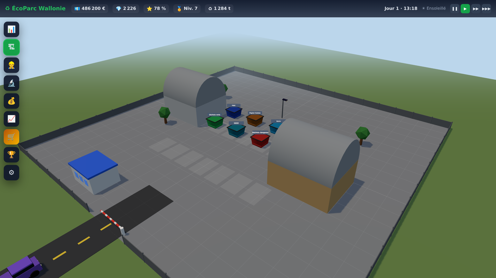
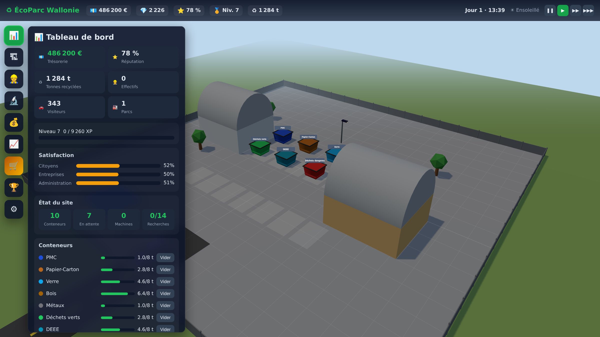
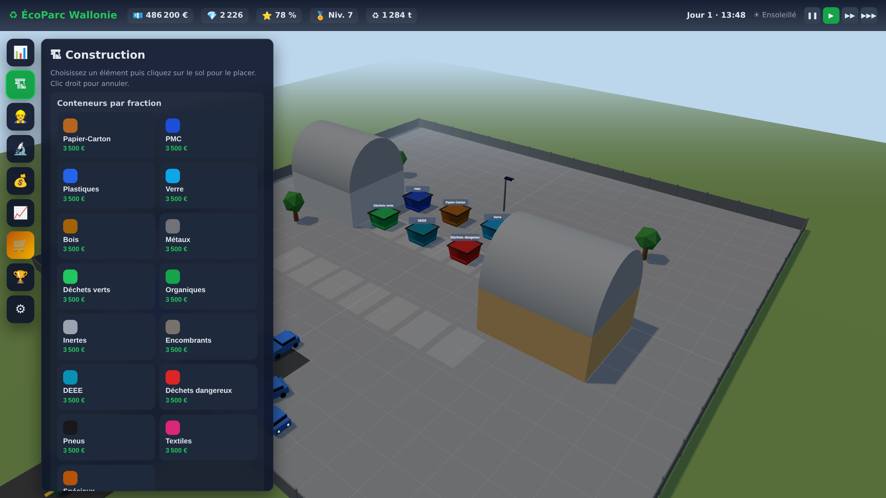
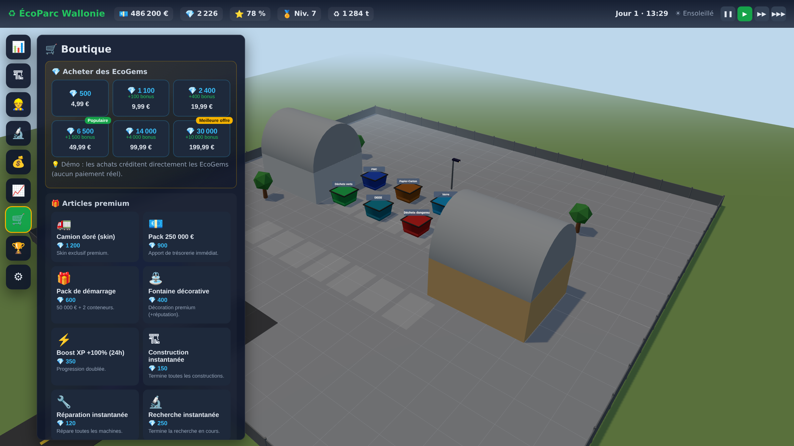

# ♻ Container Park Simulator — *ÉcoParc*

**Jeu de gestion et de simulation 3D d'un parc à conteneurs (recyparc belge).**
Vous reprenez un petit parc à conteneurs en Wallonie et le transformez
progressivement en empire national du recyclage.

> ⚠️ **Statut : prototype jouable (v0.1).**
> Ce dépôt contient un **prototype web 3D entièrement jouable** qui implémente la
> boucle de jeu complète et la majorité des systèmes décrits dans le cahier des
> charges (économie, visiteurs, tri, construction, personnel, recherche,
> météo/jour-nuit, événements, réputation, succès, boutique premium, multi-sites,
> localisation 6 langues). Il **n'est pas** un jeu commercial Unity/Unreal fini :
> voir la section [« Portée & honnêteté »](#-portée--honnêteté).



---

## ▶️ Lancer le jeu

Le jeu est 100 % web et **ne nécessite aucune connexion internet** (Three.js est
vendorisé dans `vendor/`). Il faut juste un petit serveur HTTP local (les modules
ES et l'`importmap` ne fonctionnent pas en `file://`).

```bash
# depuis la racine du dépôt
python3 -m http.server 8000
# puis ouvrez http://localhost:8000/index.html dans un navigateur récent
```

Commandes :
- **Souris** : pivoter la caméra · **molette** : zoomer
- **Clic** sur un conteneur : l'inspecter / le vider
- **🏗 Construction** : choisir un élément puis cliquer sur le sol (clic droit = annuler)
- Barre de vitesse en haut à droite : ❚❚ pause · ▶ · ▶▶ · ▶▶▶

---

## 🎮 Aperçu

| Tableau de bord | Construction | Boutique premium |
|---|---|---|
|  |  |  |

---

## 🧩 Systèmes implémentés

- **Monde 3D procédural** (Three.js) : dalle, clôtures, route d'entrée + barrière,
  conteneurs, bâtiments, arbres, lampadaires, véhicules animés.
- **Cycle jour/nuit** dynamique (position du soleil, couleur du ciel, lampadaires
  qui s'allument la nuit) et **météo** (soleil, pluie, neige, brouillard, orage)
  avec **saisons**.
- **IA de visiteurs** : génération de visiteurs (nom, âge, profil, véhicule),
  arrivée en voiture/remorque/utilitaire/camion, stationnement, déchargement,
  départ. Les apports dépendent du profil (particulier, artisan, garagiste…).
- **+60 catégories de déchets** (`src/data.js`) avec valeur €/t, coût de
  traitement, risque environnemental, taux de recyclage, densité, fraction de tri.
- **Économie complète** : trésorerie, revenus/dépenses, emprunts & intérêts,
  taxes, assurances, salaires, entretien, subventions.
- **Tri & valorisation** : chaque conteneur reçoit une fraction ; le vider encaisse
  la valeur des matières (modulée par équipements, recherche, moral du personnel).
- **Construction** : conteneurs (15 fractions), routes, parkings, clôtures,
  éclairage, bureaux, hangars, entrepôts, aires de chargement, postes de sécurité,
  décorations.
- **Personnel** : 7 métiers, salaire, compétence, moral, fatigue, expérience.
- **Équipements** : compacteur, presse, broyeur, chargeuse, chariot, pont-bascule,
  camion — usure, pannes, réparation, bonus.
- **Arbre de recherche** : 14 technologies sur 7 branches (automatisation, IA,
  robotique, énergie verte, logistique, sécurité, productivité).
- **Événements aléatoires** : incendies, pannes, contrôles, grèves, pollutions,
  accidents, tempêtes, subventions, contrats.
- **Réputation** à 3 dimensions (citoyens / entreprises / administration).
- **Multi-sites** : ouverture de parcs régionaux (débloqué par la recherche).
- **+100 succès** générés (paliers tonnes/€/visiteurs/niveau/réputation + collecte).
- **Monétisation** : monnaie premium **EcoGems**, 6 packs, boutique d'articles,
  accélérateurs, **Battle Pass** (gratuit + premium), **abonnement VIP**,
  récompenses quotidiennes/hebdomadaires.
- **Localisation** : 🇫🇷 français (source) · 🇬🇧 anglais · 🇳🇱 néerlandais ·
  🇩🇪 allemand · 🇪🇸 espagnol · 🇮🇹 italien — changeable en jeu.
- **Audio procédural** (WebAudio) : ambiance, SFX, petite musique générative.
- **Sauvegarde** locale automatique (localStorage), nouvelle partie.

---

## 🗂 Architecture

```
index.html            Point d'entrée + importmap (Three.js local)
css/styles.css        Direction artistique (HUD, panneaux, boutique…)
src/
  game.js             Orchestrateur : boucle, temps, visiteurs, actions
  state.js            État global + sauvegarde/chargement (localStorage)
  data.js             Données : déchets, véhicules, métiers, machines, R&D, shop…
  systems.js          Logique : économie, génération visiteurs, événements, succès
  scene3d.js          Rendu 3D (Three.js) : monde, entités, jour/nuit, météo
  ui.js               Interface : HUD, 9 panneaux, toasts, inspector, modales
  i18n.js             Localisation 6 langues
  audio.js            Audio procédural (WebAudio)
vendor/three/         Three.js + OrbitControls (vendorisés, pas de CDN)
docs/                 Captures de la maquette
scripts/shoot.mjs     Génération automatisée des captures (Playwright)
```

---

## 🔬 Régénérer les captures (optionnel)

```bash
npm install three@0.160.0 playwright-core   # three pour le vendor, playwright pour la capture
python3 -m http.server 8000 &
CHROME_PATH=/chemin/vers/chrome node scripts/shoot.mjs
```

---

## 🧭 Portée & honnêteté

Le cahier des charges initial décrivait un **jeu commercial 3D complet**
(Unity/Unreal) avec assets 3D originaux, textures HD, animations, musique
enregistrée, doublages et backend de monétisation en production — soit plusieurs
**années** de travail pour un studio entier.

Ce dépôt livre à la place un **prototype web réellement jouable** qui :
- ✅ tourne immédiatement dans un navigateur, sans assets manquants
  (géométrie 3D et audio **générés par code**) ;
- ✅ implémente la **boucle de jeu et les systèmes** décrits, en français ;
- ✅ sert de **base technique** claire et extensible.

Il ne prétend **pas** être le produit final commercialisable : il n'y a pas de
modèles 3D haute-fidélité, de cinématiques, ni de paiements réels (la boutique
crédite directement les EcoGems en démo).

## 📅 Suites possibles
Portage Unity/Godot, modèles 3D détaillés, sons enregistrés, équilibrage
économique, multijoueur/cloud, build Steam (le code est structuré pour évoluer).
